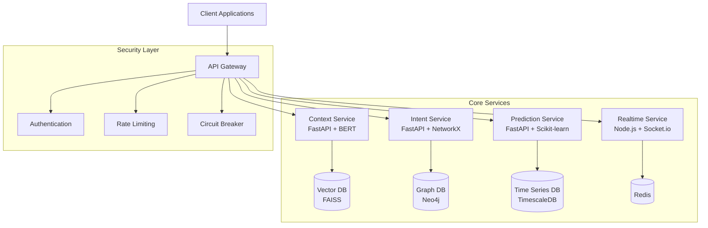

# Intent System as a Service (ISaaS) 🔒

[](https://opensource.org/licenses/MIT)
[](https://www.python.org/downloads/)
[](https://fastapi.tiangolo.com)
[](https://github.com/psf/black)
[](https://semver.org)
[]()
[](CONTRIBUTING.md)

> ⚠️ **Alpha Stage**: This project is under active development. APIs and features may change.

A sophisticated, privacy-preserving intent analysis system that revolutionizes how digital platforms understand and serve their users. Using advanced ML models and privacy-preserving techniques, ISaaS helps platforms better understand user behavior without compromising personal data.

**The Challenge**: Modern platforms need to understand user intentions to provide better experiences, but traditional solutions often compromise privacy and collect excessive personal data.

**Our Solution**: ISaaS provides real-time intent analysis while maintaining strict privacy standards through:
- Differential privacy implementation (ε=0.1)
- Privacy-preserving ML models
- Anonymous pattern recognition
- Secure graph processing
- Zero personal data storage

## 🌟 Highlights

- 🔒 **Privacy-First Design**: Advanced privacy-preserving analytics with differential privacy
- ⚡ **Real-Time Processing**: Instant intent analysis and pattern detection
- 🧠 **Smart Analysis**: ML-powered behavior understanding using BERT and NetworkX
- 🔗 **Easy Integration**: Comprehensive API with detailed documentation
- 📈 **Scalable Architecture**: Built for growth with auto-scaling capabilities

## 🏗️ Architecture

ISaaS is built on a modern microservices architecture designed for scale and resilience:



## 🗂️ Project Structure

```
├── services/          # Core microservices
│   ├── context/      # Context analysis (FastAPI + BERT)
│   │   ├── api/     # API endpoints
│   │   ├── models/  # ML models and data structures
│   │   └── utils/   # Utility functions
│   ├── intent/       # Intent processing (FastAPI + NetworkX)
│   │   ├── api/     # API endpoints
│   │   ├── graph/   # Graph processing logic
│   │   └── utils/   # Utility functions
│   ├── prediction/   # Predictions (FastAPI + Scikit-learn)
│   │   ├── api/     # API endpoints
│   │   ├── models/  # Prediction models
│   │   └── utils/   # Utility functions
│   └── realtime/     # Real-time updates (Node.js + Socket.io)
│       ├── handlers/ # Event handlers
│       └── utils/    # Utility functions
├── client/           # Frontend applications
├── gateway/          # API Gateway implementation
│   ├── auth/        # Authentication and authorization
│   ├── routing/     # Request routing and load balancing
│   └── security/    # Security middleware
├── common/           # Shared utilities and code
├── config/          # Configuration files
├── docs/            # Project documentation
├── tests/           # Test suites
└── deploy/          # Deployment configurations
```

## 🚀 Quick Start

### Prerequisites

- Python 3.10+
- Node.js 18+
- Docker & Docker Compose
- Git

### Installation

1. **Clone the repository**
```bash
git clone https://github.com/Dancode-188/intent-system-service.git
cd intent-system-service
```

2. **Set up virtual environment**
```bash
python -m venv venv
source venv/bin/activate  # or `venv\Scripts\activate` on Windows
pip install -r requirements.txt
```

3. **Configure environment**
```bash
cp .env.example .env
# Edit .env with your configuration
```

4. **Start services**
```bash
docker-compose up -d
```

5. Visit `http://localhost:8000/docs` for interactive API documentation

## 📚 Documentation

| Document | Description |
|----------|-------------|
| [Architecture Overview](docs/architecture/overview.md) | System design and components |
| [API Documentation](docs/api/index.md) | API reference and usage guides |
| [Development Guide](docs/development/guide.md) | Development setup and workflow |
| [Deployment Guide](docs/deployment/guide.md) | Deployment and scaling instructions |
| [Security & Privacy](docs/security/overview.md) | Security features and privacy measures |

## 🛠️ Core Features

- **Privacy-Preserving Analytics**
  - Differential privacy implementation (ε=0.1)
  - Data anonymization
  - Privacy-aware pattern recognition

- **Real-Time Processing**
  - WebSocket support for live updates
  - Event-driven architecture
  - Real-time pattern detection

- **Smart Intent Analysis**
  - BERT-based context understanding
  - Graph-based pattern recognition
  - Predictive analytics

- **Robust Security**
  - JWT authentication
  - Rate limiting
  - Circuit breaker pattern
  - CORS protection

## 📖 Recent Blog Posts

- [Building Privacy Into Every Request: An API Gateway Journey](blog/api-gateway-journey.md)
- [The Web is Watching: Building a System That Understands Privacy](blog/privacy-first-design.md)

## 🤝 Contributing

We welcome contributions! Please see our [Contributing Guide](CONTRIBUTING.md) for:
- Code of Conduct
- Development Process
- Pull Request Guidelines
- Testing Requirements

## 📄 License

This project is licensed under the MIT License - see the [LICENSE](LICENSE) file for details.

## 💬 Support

- 📧 Email: danielbitengo@gmail.com
- 🐛 [Issue Tracker](https://github.com/Dancode-188/intent-system-service/issues)
- 💭 [Discussions](https://github.com/Dancode-188/intent-system-service/discussions)

## ⭐ Show Your Support

Give a ⭐️ if this project helped you!

## 🔧 Technologies Used

- **Backend**
  - FastAPI: Main API framework
  - BERT: Natural language processing
  - NetworkX: Graph processing
  - Scikit-learn: Machine learning predictions
  - Socket.io: Real-time updates

- **Databases**
  - FAISS: Vector database
  - Neo4j: Graph database
  - TimescaleDB: Time series data
  - Redis: Caching and rate limiting

- **DevOps & Monitoring**
  - Docker: Containerization
  - Prometheus: Metrics collection
  - Grafana: Monitoring dashboards
  - ELK Stack: Logging

## 🎯 System Benchmarks

- Response Time: < 100ms for standard requests
- Privacy Guarantee: ε=0.1 differential privacy
- Throughput: 1000+ requests/second
- Accuracy: > 90% intent recognition
- Scalability: Horizontal scaling with zero downtime

## 🛣️ Roadmap

- [x] Core Architecture Implementation
- [x] Privacy-Preserving Analytics
- [x] API Gateway & Service Mesh
- [ ] Advanced Pattern Recognition (In Progress)
- [ ] Enhanced Privacy Controls (Planned)
- [ ] Multi-Region Support (Planned)
- [ ] Enterprise Features (Planned)

## 📝 Version History

- 0.1.0 (Alpha)
  - Initial architecture implementation
  - Core services setup
  - Basic privacy features
  - API Gateway implementation

## ✨ Acknowledgments

- BERT model architecture by Google Research
- FastAPI framework by Sebastian Ramirez
- NetworkX community for graph processing tools
- All our contributors and users