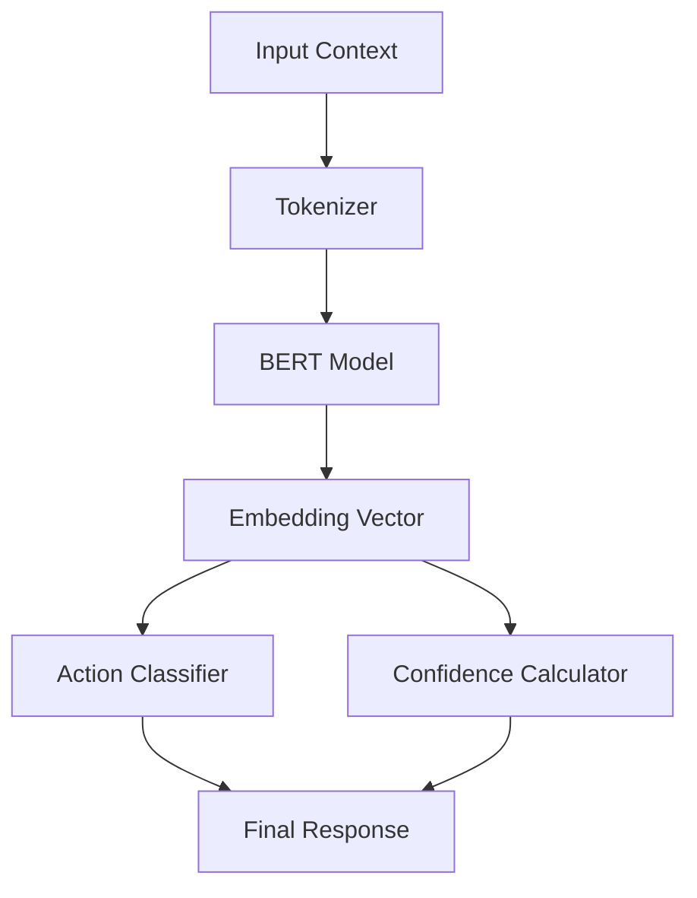

# Context Service ML System

## Overview

The Context Service ML system uses BERT-based embeddings to analyze and understand user actions in real-time. The system comprises three main components:

1. BERT Embedding Generation
2. Action Classification
3. Confidence Scoring

## System Architecture



## Components

### 1. BERT Model

- Model: DistilBERT Base Uncased
- Input Size: 512 tokens
- Embedding Size: 768 dimensions
- Batch Size: 32
- Framework: PyTorch + Transformers

### 2. Action Classification

Classification categories:
- Exploration (browsing/viewing)
- Search (query/find)
- Transaction (purchase/convert)
- Other (unclassified)

### 3. Confidence Scoring

- Range: 0.0 - 1.0
- Based on embedding properties
- Normalized using vector norms

## Performance Characteristics

| Metric | Target | Notes |
|--------|--------|-------|
| Inference Time | < 100ms | p95 latency |
| Batch Processing | < 500ms | 32 requests |
| Memory Usage | < 2GB | Model + runtime |
| GPU Utilization | Optional | CPU fallback available |

## Privacy Measures

1. Differential Privacy
   - Epsilon: 0.1
   - Delta: 1e-5

2. Data Minimization
   - Token filtering
   - Context sanitization
   - PII removal

## Implementation Details

### 1. Model Initialization

```python
from transformers import AutoTokenizer, AutoModel

class ContextService:
    def __init__(self, settings: Settings):
        self.tokenizer = AutoTokenizer.from_pretrained(settings.MODEL_NAME)
        self.model = AutoModel.from_pretrained(settings.MODEL_NAME)
        self.max_length = settings.MAX_SEQUENCE_LENGTH
```

### 2. Embedding Generation

```python
async def generate_embedding(self, text: str) -> np.ndarray:
    inputs = self.tokenizer(
        text,
        max_length=self.max_length,
        padding=True,
        truncation=True,
        return_tensors="pt"
    )
    
    with torch.no_grad():
        outputs = self.model(**inputs)
        embeddings = outputs.last_hidden_state[:, 0, :].numpy()
    
    return embeddings[0]
```

### 3. Action Classification

```python
def _classify_action(self, action: str, embedding: np.ndarray) -> str:
    action_lower = action.lower()
    if "view" in action_lower or "browse" in action_lower:
        return "exploration"
    elif "search" in action_lower or "find" in action_lower:
        return "search"
    elif "purchase" in action_lower or "buy" in action_lower:
        return "transaction"
    else:
        return "other"
```

## Usage Guidelines

### 1. Input Preparation

```python
context_text = f"{action} {self._format_context(context)}"
```

Best practices:
- Clean input text
- Remove special characters
- Normalize whitespace
- Truncate long inputs

### 2. Batch Processing

For multiple requests:
```python
async def process_batch(self, requests: List[ContextRequest]) -> List[ContextResponse]:
    # Implementation details in bert.md
    pass
```

### 3. Error Handling

```python
try:
    embedding = await self.generate_embedding(text)
except Exception as e:
    logger.error(f"Embedding generation failed: {e}")
    raise MLServiceError("Failed to generate embedding")
```

## Monitoring

### Key Metrics

1. Model Performance
   - Inference time
   - Embedding quality
   - Classification accuracy
   - Confidence distribution

2. Resource Usage
   - Memory consumption
   - GPU utilization
   - Batch processing efficiency

### Health Checks

```python
async def check_model_health(self) -> bool:
    try:
        # Test embedding generation
        test_text = "test context"
        embedding = await self.generate_embedding(test_text)
        return len(embedding) == 768
    except Exception:
        return False
```

## Configuration

### Model Settings

```python
class Settings(BaseSettings):
    MODEL_NAME: str = "distilbert-base-uncased"
    MAX_SEQUENCE_LENGTH: int = 512
    BATCH_SIZE: int = 32
```

### Environment Variables

| Variable | Description | Default |
|----------|-------------|---------|
| CONTEXT_MODEL_NAME | BERT model variant | distilbert-base-uncased |
| CONTEXT_MAX_SEQUENCE_LENGTH | Max input length | 512 |
| CONTEXT_BATCH_SIZE | Processing batch size | 32 |

## Optimization Tips

1. Input Processing
   - Cache tokenization results
   - Batch similar requests
   - Pre-process text inputs

2. Model Optimization
   - Use half-precision (FP16)
   - Enable CUDA if available
   - Optimize batch sizes

3. Resource Management
   - Monitor memory usage
   - Implement request queuing
   - Scale horizontally when needed