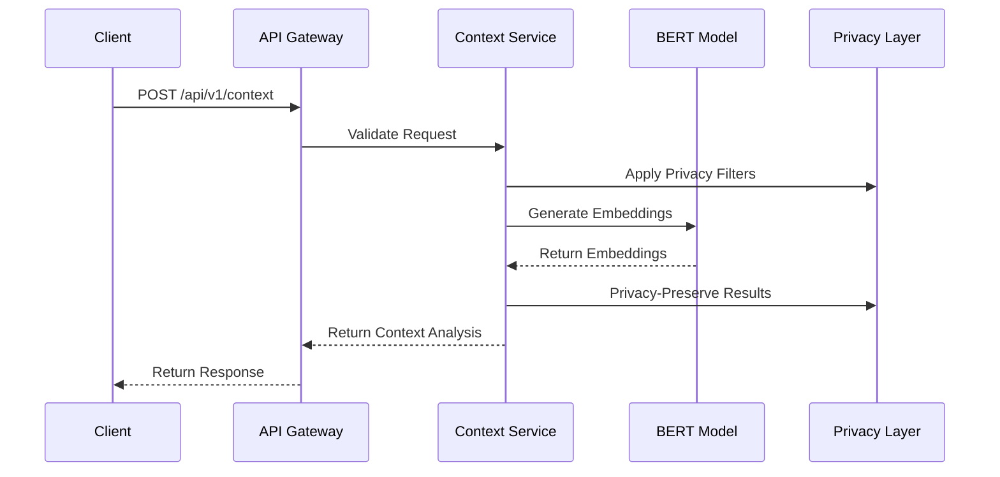

# Context Service Documentation

## 1. Overview

The Context Service is a crucial component of the Intent System as a Service (ISaaS) platform, responsible for analyzing and understanding user actions in real-time. It uses BERT-based embeddings to create context-aware vector representations of user actions and their associated metadata.

### 1.1 Core Responsibilities

- Generate embeddings for user actions and context
- Classify action types based on behavior patterns
- Provide confidence scores for context analysis
- Ensure privacy-preserving context processing

## 2. Architecture

### 2.1 Core Components

1. **ML Pipeline**
   - BERT Model (DistilBERT base uncased)
   - Tokenizer
   - Embedding Generator
   - Action Classifier

2. **API Layer**
   - FastAPI-based REST endpoints
   - Request validation
   - Rate limiting
   - Authentication/Authorization

3. **Privacy Layer**
   - Differential privacy implementation
   - Data minimization
   - Privacy-preserving embeddings

### 2.2 Service Flow



## 3. Technical Details

### 3.1 Dependencies

- FastAPI: Web framework
- Transformers: BERT model implementation
- PyTorch: ML framework
- Redis: Rate limiting and caching
- Prometheus: Metrics and monitoring

### 3.2 Key Features

1. **Real-time Processing**
   - Immediate context analysis
   - Low-latency response times (<100ms target)
   - Batch processing capabilities

2. **Privacy Protection**
   - Epsilon value: 0.1
   - Delta value: 1e-5
   - Privacy-preserving embeddings

3. **Action Classification**
   - Exploration actions
   - Search actions
   - Transaction actions
   - Other interactions

### 3.3 Performance Characteristics

- Maximum sequence length: 512 tokens
- Batch size: 32 requests
- Embedding dimension: 768 (DistilBERT base)

## 4. Integration Points

### 4.1 Input Interface

```json
{
    "user_id": "string",
    "action": "string",
    "context": {
        "key": "value"
    },
    "timestamp": "datetime"
}
```

### 4.2 Output Interface

```json
{
    "context_id": "string",
    "embedding": [float],
    "confidence": float,
    "action_type": "string",
    "processed_timestamp": "datetime"
}
```

## 5. Configuration

### 5.1 Environment Variables

| Variable | Description | Default |
|----------|-------------|---------|
| CONTEXT_SERVICE_NAME | Service identifier | "context-service" |
| CONTEXT_VERSION | Service version | "0.1.0" |
| CONTEXT_MODEL_NAME | BERT model name | "distilbert-base-uncased" |
| CONTEXT_MAX_SEQUENCE_LENGTH | Max input length | 512 |
| CONTEXT_BATCH_SIZE | Processing batch size | 32 |
| CONTEXT_PRIVACY_EPSILON | Privacy parameter | 0.1 |
| CONTEXT_PRIVACY_DELTA | Privacy parameter | 1e-5 |

## 6. Error Handling

### 6.1 Error Categories

1. **API Errors**
   - 400: Invalid request format
   - 401: Authentication failure
   - 403: Authorization failure
   - 429: Rate limit exceeded

2. **Processing Errors**
   - 500: Model processing failure
   - 503: Service unavailable

### 6.2 Error Response Format

```json
{
    "detail": "Error description",
    "error_code": "ERROR_TYPE",
    "request_id": "request-id"
}
```

## 7. Monitoring

### 7.1 Health Check

- Endpoint: `/health`
- Metrics: `/metrics`
- Service status monitoring
- Performance metrics tracking

### 7.2 Key Metrics

1. **Performance Metrics**
   - Request latency
   - Processing time
   - Model inference time
   - Batch processing efficiency

2. **Operational Metrics**
   - Request count
   - Error rate
   - Rate limit hits
   - Resource utilization

## 8. Security

### 8.1 Authentication

- API key-based authentication
- Request signing
- Rate limiting per API key

### 8.2 Data Protection

- Input sanitization
- Privacy-preserving processing
- Minimal data retention
- Secure embedding storage