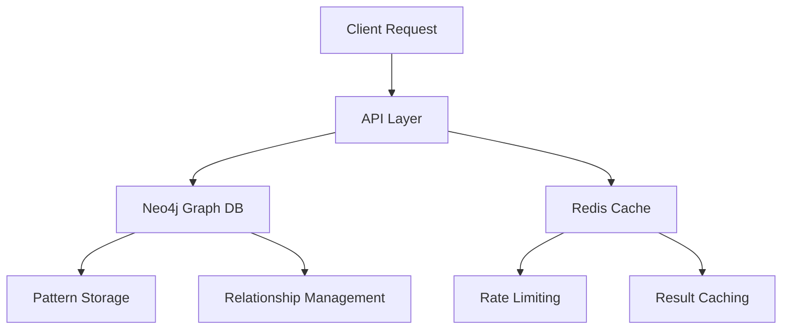

# Intent Service Database Documentation

## Database Architecture

The Intent Service uses a multi-database approach combining:
- Neo4j for graph relationships
- Redis for caching and rate limiting

### Database Components



## Neo4j Schema

### Node Labels

1. **Pattern Nodes**
```cypher
CREATE CONSTRAINT pattern_id IF NOT EXISTS
FOR (p:Pattern) REQUIRE p.id IS UNIQUE
```

Properties:
```javascript
{
    id: string,            // Unique pattern identifier
    user_id: string,       // Associated user
    data: object,          // Pattern data
    pattern_type: string,  // Pattern type
    confidence: float,     // Confidence score
    created_at: datetime   // Creation timestamp
}
```

2. **Relationship Types**
```cypher
(:Pattern)-[:RELATED_TO]->(:Pattern)
(:Pattern)-[:LEADS_TO]->(:Pattern)
(:Pattern)-[:SIMILAR_TO]->(:Pattern)
```

### Neo4j Queries

1. **Pattern Retrieval**
```cypher
MATCH (p:Pattern)
WHERE p.user_id = $user_id
AND p.confidence >= $min_confidence
AND ($pattern_type IS NULL OR p.pattern_type = $pattern_type)
WITH p, [(p)-[r:RELATED_TO*1..$max_depth]-(related) | related] as related_patterns
RETURN p, related_patterns
LIMIT 100
```

2. **Pattern Storage**
```cypher
CREATE (p:Pattern {
    id: $pattern_id,
    user_id: $user_id,
    data: $intent_data,
    patterns: $patterns,
    pattern_type: $pattern_type,
    confidence: $confidence,
    created_at: datetime()
})
```

## Redis Implementation

### Key Structures

1. **Rate Limiting**
```
rate_limit:{client_id}:{endpoint}  -> Sorted Set
usage:{client_id}:{endpoint}:{date} -> Hash
```

2. **Cache Keys**
```
pattern:{pattern_id}         -> Hash
patterns:user:{user_id}      -> Set
pattern_types:{pattern_type} -> Set
```

### Redis Commands

1. **Rate Limiting Check**
```redis
MULTI
  ZREMRANGEBYSCORE rate_limit:{client_id}:{endpoint} 0 {window_start}
  ZCARD rate_limit:{client_id}:{endpoint}
  ZADD rate_limit:{client_id}:{endpoint} {timestamp} {request_id}
  EXPIRE rate_limit:{client_id}:{endpoint} {window * 2}
EXEC
```

2. **Pattern Caching**
```redis
HSET pattern:{pattern_id} 
    id {pattern_id}
    data {serialized_data}
    confidence {score}
    timestamp {created_at}
```

## Connection Management

### Neo4j Handler
```python
class Neo4jHandler:
    async def connect(self) -> None:
        """Establish connection to Neo4j with retry logic"""
        retry_count = 0
        while retry_count < self.max_retries:
            try:
                if not self.driver:
                    self.driver = AsyncGraphDatabase.driver(
                        self.settings.NEO4J_URI,
                        auth=(self.settings.NEO4J_USER, 
                              self.settings.NEO4J_PASSWORD),
                        max_connection_lifetime=200
                    )
                await self.driver.verify_connectivity()
                return
            except ServiceUnavailable as e:
                retry_count += 1
                if retry_count == self.max_retries:
                    raise ConnectionError(
                        f"Could not connect to Neo4j: {str(e)}"
                    )
                await asyncio.sleep(self.retry_delay * retry_count)
```

### Redis Handler
```python
class ConnectionManager:
    async def init(self):
        """Initialize Redis pool"""
        self.redis_pool = redis.ConnectionPool.from_url(
            self.settings.REDIS_URL,
            max_connections=self.settings.REDIS_POOL_SIZE,
            decode_responses=True
        )
```

## Data Migration

### Neo4j Migrations
1. **Initialize Constraints**
```cypher
CREATE CONSTRAINT pattern_id IF NOT EXISTS
FOR (p:Pattern) REQUIRE p.id IS UNIQUE;
```

2. **Initialize Indexes**
```cypher
CREATE INDEX pattern_user_idx IF NOT EXISTS
FOR (p:Pattern) ON (p.user_id);

CREATE INDEX pattern_type_idx IF NOT EXISTS
FOR (p:Pattern) ON (p.pattern_type);
```

## Monitoring & Maintenance

### Health Checks
```python
async def check_health(self) -> Dict[str, str]:
    """Check Neo4j connection health"""
    try:
        await self.neo4j.execute_query("RETURN 1", {})
        return {
            "status": "up",
            "message": "Connected to Neo4j"
        }
    except Exception as e:
        return {
            "status": "down",
            "message": f"Neo4j connection error: {str(e)}"
        }
```

### Performance Monitoring

1. **Neo4j Metrics**
```python
NEO4J_QUERY_TIME = Histogram(
    'neo4j_query_duration_seconds',
    'Duration of Neo4j queries',
    ['query_type']
)
```

2. **Redis Metrics**
```python
REDIS_OPERATION_TIME = Histogram(
    'redis_operation_duration_seconds',
    'Duration of Redis operations',
    ['operation_type']
)
```

## Backup & Recovery

### Neo4j Backup
```bash
neo4j-admin dump --database=neo4j --to=/backup/neo4j-backup.dump
```

### Redis Backup
```bash
# Redis configuration
save 900 1
save 300 10
save 60 10000
dir /data
```

## Error Handling

### Database Errors
```python
class DatabaseError(IntentServiceException):
    """Raised when database operations fail"""
    pass

class ConnectionError(DatabaseError):
    """Raised when database connection fails"""
    pass
```

### Recovery Strategies
1. Connection Failures
   - Exponential backoff
   - Circuit breaker
   - Fallback to cache

2. Query Failures
   - Retry with timeout
   - Query optimization
   - Error logging