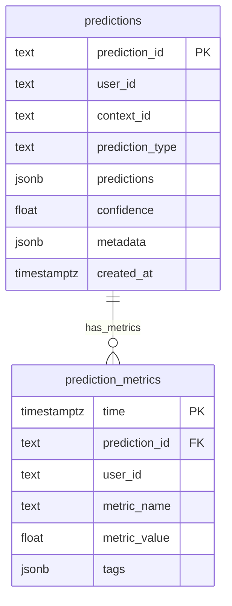

# Prediction Service Database Schema

## Overview
The Prediction Service uses TimescaleDB for efficient storage and retrieval of predictions and time-series metrics. This document details the database schema, indexing strategy, and query patterns.

## Database Architecture

### Schema Diagram


## Table Definitions

### Predictions Table
Primary storage for prediction results.

```sql
CREATE TABLE IF NOT EXISTS predictions (
    prediction_id TEXT PRIMARY KEY,
    user_id TEXT NOT NULL,
    context_id TEXT NOT NULL,
    prediction_type TEXT NOT NULL,
    predictions JSONB NOT NULL,
    confidence FLOAT NOT NULL,
    metadata JSONB,
    created_at TIMESTAMPTZ NOT NULL DEFAULT NOW()
);
```

#### Columns
- `prediction_id`: Unique identifier for each prediction
- `user_id`: User identifier for prediction
- `context_id`: Associated context identifier
- `prediction_type`: Type of prediction (e.g., "short_term", "medium_term")
- `predictions`: JSON array of predictions with probabilities
- `confidence`: Overall confidence score
- `metadata`: Additional prediction metadata
- `created_at`: Timestamp of prediction creation

#### Indexes
```sql
CREATE INDEX IF NOT EXISTS idx_predictions_user_id ON predictions(user_id);
CREATE INDEX IF NOT EXISTS idx_predictions_context_id ON predictions(context_id);
CREATE INDEX IF NOT EXISTS idx_predictions_created_at ON predictions(created_at DESC);
```

### Prediction Metrics Table
Time-series metrics for prediction analysis.

```sql
CREATE TABLE IF NOT EXISTS prediction_metrics (
    time TIMESTAMPTZ NOT NULL,
    prediction_id TEXT NOT NULL,
    user_id TEXT NOT NULL,
    metric_name TEXT NOT NULL,
    metric_value FLOAT NOT NULL,
    tags JSONB,
    FOREIGN KEY (prediction_id) REFERENCES predictions(prediction_id)
);

-- Convert to hypertable
SELECT create_hypertable('prediction_metrics', 'time', if_not_exists => TRUE);
```

#### Columns
- `time`: Timestamp of metric record (partitioning column)
- `prediction_id`: Reference to associated prediction
- `user_id`: User identifier for metrics
- `metric_name`: Name of the metric
- `metric_value`: Numerical metric value
- `tags`: Additional metric metadata

#### Indexes
```sql
CREATE INDEX IF NOT EXISTS idx_metrics_prediction_id ON prediction_metrics(prediction_id);
CREATE INDEX IF NOT EXISTS idx_metrics_user_id ON prediction_metrics(user_id);
```

## TimescaleDB Configuration

### Hypertable Setup
The `prediction_metrics` table is configured as a hypertable for time-series optimization:

```sql
SELECT create_hypertable(
    'prediction_metrics',
    'time',
    chunk_time_interval => INTERVAL '1 day',
    if_not_exists => TRUE
);
```

### Retention Policy
```sql
-- Set retention policy for metrics (30 days)
SELECT add_retention_policy(
    'prediction_metrics',
    INTERVAL '30 days',
    if_not_exists => TRUE
);
```

## Query Patterns

### Store Prediction
```python
async def store_prediction(
    self,
    prediction_id: str,
    user_id: str,
    context_id: str,
    prediction_type: str,
    predictions: Dict[str, Any],
    confidence: float,
    metadata: Optional[Dict[str, Any]] = None
) -> None:
    async with self.pool.acquire() as conn:
        await conn.execute("""
            INSERT INTO predictions (
                prediction_id, user_id, context_id, prediction_type,
                predictions, confidence, metadata, created_at
            ) VALUES ($1, $2, $3, $4, $5, $6, $7, $8)
        """, prediction_id, user_id, context_id, prediction_type,
            predictions, confidence, metadata, datetime.utcnow())
```

### Retrieve Prediction
```python
async def get_prediction(self, prediction_id: str) -> Optional[Dict[str, Any]]:
    async with self.pool.acquire() as conn:
        record = await conn.fetchrow("""
            SELECT * FROM predictions WHERE prediction_id = $1
        """, prediction_id)
        
        if record:
            return dict(record)
        return None
```

### Store Metrics
```python
async def store_metric(
    self,
    prediction_id: str,
    metric_name: str,
    metric_value: float,
    tags: Optional[Dict[str, Any]] = None
) -> None:
    async with self.pool.acquire() as conn:
        await conn.execute("""
            INSERT INTO prediction_metrics (
                time, prediction_id, metric_name, metric_value, tags
            ) VALUES ($1, $2, $3, $4, $5)
        """, datetime.utcnow(), prediction_id, metric_name, metric_value, tags)
```

### Historical Analysis
```python
async def get_historical_predictions(
    self,
    user_id: str,
    start_time: datetime,
    end_time: datetime
) -> List[Dict[str, Any]]:
    async with self.pool.acquire() as conn:
        records = await conn.fetch("""
            SELECT * FROM predictions 
            WHERE user_id = $1 
            AND created_at BETWEEN $2 AND $3
            ORDER BY created_at DESC
        """, user_id, start_time, end_time)
        return [dict(record) for record in records]
```

## Performance Optimization

### Connection Pool Management
```python
async def initialize(self) -> None:
    self.pool = await asyncpg.create_pool(
        dsn=self.settings.TIMESCALE_URL,
        min_size=5,
        max_size=self.settings.TIMESCALE_POOL_SIZE
    )
```

### Batch Operations
For bulk inserts or updates:
```sql
-- Example batch insert
INSERT INTO prediction_metrics (time, prediction_id, metric_name, metric_value)
SELECT * FROM unnest($1::timestamptz[], $2::text[], $3::text[], $4::float[])
```

## Data Retention

### Continuous Aggregates
```sql
-- Create continuous aggregate for hourly metrics
CREATE MATERIALIZED VIEW metrics_hourly
WITH (timescaledb.continuous) AS
SELECT
    time_bucket('1 hour', time) AS bucket,
    prediction_id,
    metric_name,
    avg(metric_value) as avg_value,
    count(*) as sample_count
FROM prediction_metrics
GROUP BY bucket, prediction_id, metric_name;
```

### Compression Policy
```sql
-- Enable compression
ALTER TABLE prediction_metrics SET (
    timescaledb.compress,
    timescaledb.compress_segmentby = 'prediction_id,metric_name'
);

-- Add compression policy (after 7 days)
SELECT add_compression_policy('prediction_metrics',
    INTERVAL '7 days');
```

## Monitoring Queries

### Database Health
```sql
-- Check hypertable size
SELECT hypertable_size('prediction_metrics');

-- Check chunk information
SELECT * FROM chunks_detailed_size('prediction_metrics');

-- Monitor compression status
SELECT * FROM chunk_compression_stats('prediction_metrics');
```

### Performance Analysis
```sql
-- Query performance metrics
SELECT
    metric_name,
    count(*),
    avg(metric_value),
    percentile_cont(0.95) WITHIN GROUP (ORDER BY metric_value)
FROM prediction_metrics
WHERE time > now() - INTERVAL '24 hours'
GROUP BY metric_name;
```

## Backup and Recovery
TimescaleDB backups should include both regular PostgreSQL tables and hypertables:

```bash
# Backup
pg_dump -h localhost -U prediction_user -d prediction_db -F c -f backup.dump

# Restore
pg_restore -h localhost -U prediction_user -d prediction_db backup.dump
```