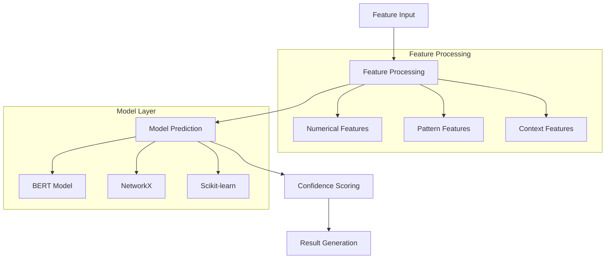
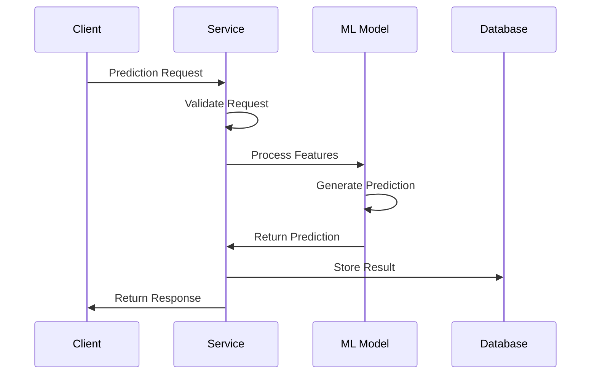

# Machine Learning System Documentation

## Overview
The Prediction Service uses a sophisticated machine learning system to generate predictions based on user behavior patterns and context. This document details the ML architecture, training process, and prediction generation.

## Architecture Overview



## Model Components

### 1. Prediction Model

Core model implementation handling predictions:

```python
class PredictionModel:
    """Manages ML models for prediction generation"""
    def __init__(
        self,
        model_path: str,
        confidence_threshold: float = 0.7,
        use_scaler: bool = True
    ):
        self.model_path = model_path
        self.confidence_threshold = confidence_threshold
        self.use_scaler = use_scaler
        self.model: Optional[BaseEstimator] = None
        self.scaler: Optional[StandardScaler] = None

    async def predict(
        self,
        features: Dict[str, Any],
        prediction_type: str
    ) -> Dict[str, Any]:
        if not self._initialized:
            raise ModelError("Model not initialized")
            
        try:
            # Validate and preprocess
            feature_array = self._preprocess_features(features)
            
            # Generate predictions
            probabilities = self.model.predict_proba(feature_array)[0]
            predicted_classes = self.model.classes_
            
            # Calculate confidence
            confidence = self._calculate_confidence(probabilities)
            
            return {
                "predictions": self._format_predictions(
                    predicted_classes, 
                    probabilities
                ),
                "confidence": confidence,
                "metadata": self._generate_metadata(
                    prediction_type, 
                    feature_array
                )
            }
```

### 2. Feature Processing

Handles feature extraction and preprocessing:

```python
def _preprocess_features(self, features: Dict[str, Any]) -> np.ndarray:
    """Preprocess features for prediction"""
    # Extract numerical features
    numerical_features = [
        len(features.get("intent_patterns", [])),
        self._calculate_pattern_diversity(
            features.get("intent_patterns", [])
        ),
        self._encode_context_feature(
            features.get("user_context", {}).get("device", "unknown")
        ),
        self._encode_context_feature(
            features.get("user_context", {}).get("location", "unknown")
        )
    ]
    
    # Convert to array and scale
    feature_array = np.array(numerical_features).reshape(1, -1)
    if self.use_scaler and self.scaler:
        feature_array = self.scaler.transform(feature_array)
        
    return feature_array
```

### 3. Pattern Analysis

Pattern diversity and feature calculations:

```python
def _calculate_pattern_diversity(self, patterns: List[str]) -> float:
    """Calculate diversity score for patterns"""
    if not patterns:
        return 0.0
        
    valid_patterns = [p for p in patterns if p and isinstance(p, str)]
    if not valid_patterns:
        return 0.0
        
    unique_patterns = len(set(valid_patterns))
    return unique_patterns / len(valid_patterns)
```

## Training Pipeline

### 1. Model Trainer

```python
class ModelTrainer:
    """Handles model training and persistence"""
    def __init__(
        self,
        model_path: str,
        model_config: Optional[Dict[str, Any]] = None
    ):
        self.model_path = Path(model_path)
        self.model_config = model_config or {
            'n_estimators': 100,
            'max_depth': 10,
            'random_state': 42
        }

    async def train_model(
        self,
        training_data: List[Dict[str, Any]]
    ) -> None:
        """Train the prediction model"""
        try:
            # Prepare data
            X, y = self.prepare_training_data(training_data)
            
            # Initialize and fit scaler
            self.scaler = StandardScaler()
            X_scaled = self.scaler.fit_transform(X)
            
            # Train model
            self.model = RandomForestClassifier(**self.model_config)
            self.model.fit(X_scaled, y)
            
            # Save model and scaler
            await self.save_model()
```

### 2. Data Preparation

```python
def prepare_training_data(
    self,
    raw_data: List[Dict[str, Any]]
) -> tuple[np.ndarray, np.ndarray]:
    """Prepare raw data for training"""
    features = []
    labels = []
    
    for data in raw_data:
        # Extract features
        numerical_features = self._extract_numerical_features(
            data['features']
        )
        features.append(numerical_features)
        labels.append(data['label'])
        
    return np.array(features), np.array(labels)
```

## Model Evaluation

### 1. Evaluation Metrics

```python
async def evaluate_model(
    self,
    test_data: List[Dict[str, Any]]
) -> Dict[str, float]:
    """Evaluate model performance"""
    if not self.model:
        raise ValueError("Model not trained")
        
    try:
        # Prepare test data
        X_test, y_test = self.prepare_training_data(test_data)
        X_test_scaled = self.scaler.transform(X_test)
        
        # Get predictions
        y_pred = self.model.predict(X_test_scaled)
        y_prob = self.model.predict_proba(X_test_scaled)
        
        # Calculate metrics
        accuracy = (y_test == y_pred).mean()
        
        return {
            "accuracy": float(accuracy),
            "feature_importance": dict(zip(
                [f"feature_{i}" for i in range(X_test.shape[1])],
                self.model.feature_importances_.tolist()
            ))
        }
```

### 2. Confidence Scoring

```python
def _calculate_confidence(self, probabilities: np.ndarray) -> float:
    """Calculate confidence score for predictions"""
    # Use max probability as base confidence
    base_confidence = float(np.max(probabilities))
    
    # Adjust based on probability distribution
    entropy = -np.sum(probabilities * np.log2(probabilities + 1e-10))
    max_entropy = -np.log2(1.0 / len(probabilities))
    entropy_factor = 1 - (entropy / max_entropy)
    
    # Combine factors
    confidence = (base_confidence + entropy_factor) / 2
    return min(max(confidence, 0.0), 1.0)
```

## Model Management

### 1. Model Persistence

```python
async def save_model(self) -> None:
    """Save trained model and scaler"""
    if not self.model:
        raise ValueError("Cannot save: model not trained")
        
    timestamp = datetime.utcnow().strftime("%Y%m%d_%H%M%S")
    
    try:
        # Create model directory
        self.model_path.mkdir(parents=True, exist_ok=True)
        
        # Save model
        model_file = self.model_path / f"prediction_model_{timestamp}.joblib"
        joblib.dump(self.model, model_file)
        
        # Save scaler
        if self.scaler:
            scaler_file = self.model_path / f"scaler_{timestamp}.joblib"
            joblib.dump(self.scaler, scaler_file)
```

### 2. Model Loading

```python
async def initialize(self) -> None:
    """Initialize model and scaler"""
    try:
        # Load model
        self.model = joblib.load(f"{self.model_path}/prediction_model.joblib")
        
        # Load scaler if needed
        if self.use_scaler:
            self.scaler = joblib.load(f"{self.model_path}/scaler.joblib")
        
        self._initialized = True
        logger.info("Prediction model initialized successfully")
```

## Production Usage

### 1. Prediction Flow



### 2. Performance Optimization

Key considerations:
- Model loading at startup
- Feature preprocessing optimization
- Batch prediction support
- Caching strategy
- Resource management

## Monitoring and Metrics

### 1. Model Metrics
- Prediction accuracy
- Response times
- Confidence scores
- Feature importance

### 2. Performance Metrics
```python
# Metrics tracking
REQUEST_COUNT = Counter(
    'prediction_service_requests_total',
    'Total number of prediction requests',
    ['prediction_type']
)

PREDICTION_LATENCY = Histogram(
    'prediction_service_latency_seconds',
    'Prediction generation latency',
    ['prediction_type']
)
```

## Best Practices

1. **Feature Processing**
   - Validate all input features
   - Handle missing values gracefully
   - Scale numerical features
   - Encode categorical features

2. **Model Training**
   - Use cross-validation
   - Monitor for overfitting
   - Validate feature importance
   - Test with diverse data

3. **Production Deployment**
   - Version control models
   - Monitor prediction quality
   - Implement fallback strategies
   - Regular model updates

4. **Performance**
   - Optimize feature processing
   - Batch predictions when possible
   - Cache frequent predictions
   - Monitor resource usage