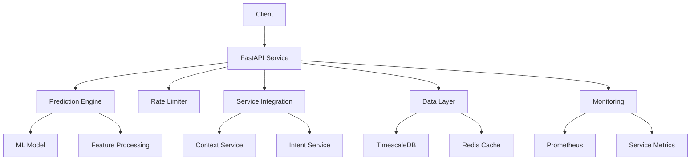
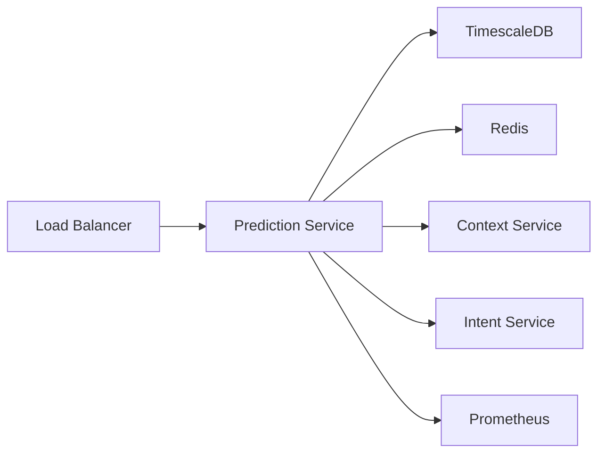

# Prediction Service Overview

## Architecture Overview

The Prediction Service is designed as a scalable, machine learning-powered prediction engine with the following key components:

### Service Architecture



### Core Components

1. **Prediction Engine**
   - Handles prediction generation using ML models
   - Processes features and calculates confidence scores
   - Manages model lifecycle and versioning
   ```python
   class PredictionModel:
       """Manages ML models for prediction generation"""
       async def predict(self, features: Dict[str, Any], prediction_type: str) -> Dict[str, Any]:
           # Model prediction logic
           ...
   ```

2. **Data Storage Layer**
   - TimescaleDB for time-series data and predictions
   - Optimized hypertables for efficient querying
   - Structured schema for predictions and metrics
   ```python
   class TimescaleDBHandler:
       """Handler for TimescaleDB operations"""
       async def store_prediction(self, prediction_id: str, ...):
           # Store prediction data
           ...
   ```

3. **Service Integration**
   - Context Service integration for feature enrichment
   - Intent Service integration for pattern analysis
   - Real-time data processing pipeline
   ```python
   class ServiceIntegration:
       """Handles integration with Context and Intent services"""
       async def enrich_prediction_request(self, request: PredictionRequest):
           # Enrich features with context and intent data
           ...
   ```

4. **Rate Limiting & Caching**
   - Redis-based rate limiting
   - Configurable rate windows and burst handling
   - Request caching for performance
   ```python
   class EnhancedRateLimiter:
       """Enhanced rate limiter with Redis backend"""
       async def check_rate_limit(self, client_id: str, endpoint: str):
           # Rate limiting logic
           ...
   ```

## Key Features

### 1. ML Model Management
- Dynamic model loading and initialization
- Feature preprocessing and validation
- Confidence score calculation
- Model versioning support

### 2. Data Management
- Time-series data storage
- Efficient querying and aggregation
- Automatic data retention policies
- Metric collection and analysis

### 3. Privacy & Security
- API key authentication
- Rate limiting protection
- Privacy-preserving predictions
- Secure data handling

### 4. Monitoring & Metrics
- Prometheus integration
- Custom metric collection
- Performance monitoring
- Health checks and diagnostics

## Data Flow

1. **Request Processing**
   ```mermaid
   sequenceDiagram
       participant C as Client
       participant S as Service
       participant M as ML Model
       participant DB as TimescaleDB
       
       C->>S: Prediction Request
       S->>S: Validate & Enrich
       S->>M: Process Features
       M->>S: Generate Prediction
       S->>DB: Store Result
       S->>C: Return Response
   ```

2. **Feature Processing**
   - Feature validation and normalization
   - Context enrichment
   - Pattern analysis
   - Confidence calculation

3. **Data Storage**
   - Prediction results
   - Performance metrics
   - Time-series data
   - Analysis results

## Performance Characteristics

### Scalability
- Configurable connection pools
- Efficient resource utilization
- Docker containerization
- Horizontal scaling support

### Reliability
- Error handling and recovery
- Circuit breaker patterns
- Health monitoring
- Automatic failover

### Performance
- Response time < 200ms (p95)
- High throughput capability
- Efficient caching
- Optimized queries

## Integration Points

1. **External Services**
   - Context Service integration
   - Intent Service integration
   - Metrics collection
   - Health monitoring

2. **Internal Components**
   - ML model integration
   - Database connections
   - Cache management
   - Rate limiting

## Configuration Overview

```python
class Settings(BaseSettings):
    """Core configuration settings"""
    SERVICE_NAME: str = "prediction-service"
    VERSION: str = "0.1.0"
    MODEL_PATH: str = "models"
    CONFIDENCE_THRESHOLD: float = 0.7
    MAX_PREDICTIONS: int = 10
    # ... additional settings
```

For detailed configuration options, see the [Configuration Guide](configuration.md).

## Deployment Architecture



## Next Steps

- [API Documentation](api.md) - Detailed API reference
- [Configuration Guide](configuration.md) - Service configuration
- [Development Guide](development.md) - Development setup
- [ML Documentation](ml/models.md) - ML model details